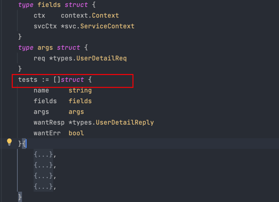

# 单元测试

## goland 单元测试 使用
- 根据代码逻辑，我们大多数的修改，都是在 logic 文件，所以我们的单元测试也是写在同一目录下
- 我们的单元测试文件，命名为 xxx_test.go
- 可以通过 goland 生成基础的模版，框架，这个不是最终版本，因为我们修改注入的环境来进行测试

### 使用 表格驱动测试 来进行单元与覆盖率测试
- 通过注入变量的方式，来实现单元测试

- OK 经过 覆盖率测试，我们发现 逻辑上还有可以优化的点，进行修复后
- 我们最终的覆盖率 达到 93%